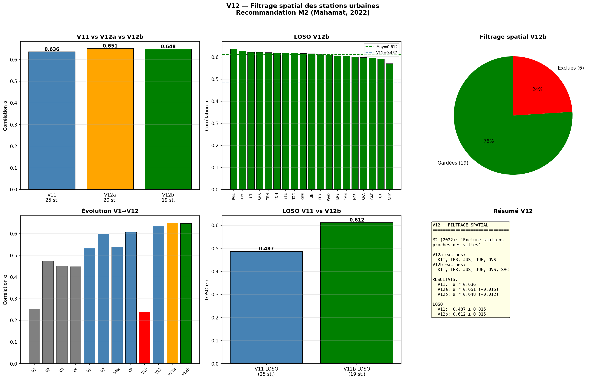

# PINN Inversion CO₂ — Séparation des flux fossiles et biosphériques en Europe

[](https://opensource.org/licenses/MIT)
[](https://www.python.org/downloads/)
[](https://doi.org/10.5281/zenodo.XXXXXXX)

Système d'inversion atmosphérique du CO₂ combinant un **réseau de neurones informé par la physique** (PINN) avec le modèle de transport lagrangien **HYSPLIT**, appliqué au réseau ICOS européen pour l'année 2019.



## Résumé en 3 chiffres

- **LOSO α r = 0.612 ± 0.015** — le modèle prédit les flux fossiles de stations qu'il n'a jamais vues
- **PINN ×12 vs bayésien** — 0.417 vs 0.033 sur mêmes données, même prior, même transport
- **r = 0.992 vs CAMS** — concordance spatiale avec le système opérationnel indépendant du Copernicus

## Contexte scientifique

Le problème : séparer les flux de CO₂ fossiles (EDGAR) et biosphériques (VPRM) à partir des concentrations atmosphériques ICOS. En configuration mono-traceur, ce problème est considéré sous-déterminé dans la littérature (Basu et al., 2016). Notre contribution : une formulation découplée `C_mod = H(α·F_foss + β·F_bio)` qui exploite les structures spatiales différentes des sources et la séparation temporelle jour/nuit.

## Architecture

```
Observations ICOS (25 stations)
    │
    ▼
Empreintes HYSPLIT hebdo (2600 fichiers)
    │
    ▼
PINN découplé (Conv2DTranspose decoder)
    │
    ├─→ α(région, mois) — correction fossile
    └─→ β global — correction biosphère
    │
    ▼
Validation : CAMS, CarbonTracker, LOSO
```

## Résultats principaux

### Progression V1 → V12

| Version | α r | LOSO | Innovation |
|---------|-----|------|-----------|
| V1 | 0.253 | — | Baseline synthétique |
| V6 | 0.523 | 0.417 | Découplage α/β |
| V9 | 0.609 | — | Séparation jour/nuit |
| V11 | 0.648 | 0.487 | Footprints hebdomadaires |
| **V12b** | **0.648** | **0.612** | **Filtrage spatial (19 stations)** |

### Validation croisée (systèmes indépendants)

| Comparaison | Spatial | Temporel | Total |
|-------------|---------|----------|-------|
| V12 vs CT2022 | 0.999 | 0.958 | 0.979 |
| **V12 vs CAMS** | **0.992** | **0.851** | **0.965** |
| CT2022 vs CAMS | 0.988 | 0.841 | 0.983 |

### Sur observations réelles ICOS (MC Dropout, 50 passes)

- **α = 1.010 ± 0.078** (IC 95% : [0.853, 1.167]) — EDGAR correct en moyenne européenne
- **β = 0.971 ± 0.023** (IC 95% : [0.926, 1.017]) — VPRM légèrement surestimé (~3%)

## Installation

```bash
git clone https://github.com/YOUR_USERNAME/pinn-inversion-co2.git
cd pinn-inversion-co2
python -m venv venv
source venv/bin/activate
pip install -r requirements.txt
```

## Données requises (externes)

Ces données ne sont pas incluses dans le repo (taille, licences). Voir `docs/DATA.md` pour les instructions de téléchargement.

- **ICOS CO₂** : [data.icos-cp.eu](https://data.icos-cp.eu) — 25 stations, 2019, niveau L1
- **ERA5 BLH + T2m** : [CDS API](https://cds.climate.copernicus.eu)
- **CarbonTracker CT2022** : [NOAA ESRL](https://gml.noaa.gov/ccgg/carbontracker/)
- **CAMS flux** : [ADS API](https://ads.atmosphere.copernicus.eu)
- **VPRM ECMWF 2019** : [ECMWF](https://confluence.ecmwf.int/)
- **EDGAR v8.0** : [EDGAR JRC](https://edgar.jrc.ec.europa.eu/)

## Structure du repo

```
pinn-inversion-co2/
├── README.md                    # Ce fichier
├── LICENSE                      # MIT
├── requirements.txt             # Dépendances Python
├── CITATION.cff                 # Métadonnées citation
├── .gitignore
├── scripts/
│   ├── v11_baseline.py          # V11 référence
│   ├── v12b_filtered.py         # V12b (meilleur LOSO)
│   ├── v13_corrector.py         # V13 correcteur statique
│   ├── v13b_dynamic.py          # V13b correcteur dynamique
│   ├── beta_fourier.py          # β Fourier (3 params)
│   ├── mc_dropout.py            # Quantification incertitude
│   ├── validation_cams.py       # Comparaison triple
│   ├── validation_forward.py    # C_mod vs C_obs
│   └── withholding_jja.py       # Test temporel
├── results/                     # Fichiers .npz des résultats
├── figures/                     # Figures finales
└── docs/
    ├── DATA.md                  # Instructions téléchargement
    ├── METHODOLOGY.md           # Détails méthodologiques
    └── LIMITATIONS.md           # Limites et perspectives
```

## Citation

Si tu utilises ce code :

```bibtex
@software{mahamat_2026_pinn_co2,
  author       = {Mahamat, Ali Ousmane},
  title        = {{PINN Inversion CO₂: Europe 2019}},
  year         = 2026,
  publisher    = {Zenodo},
  doi          = {10.5281/zenodo.XXXXXXX},
  url          = {https://github.com/YOUR_USERNAME/pinn-inversion-co2}
}
```

## Limites connues

Voir `docs/LIMITATIONS.md` pour le détail. En résumé :

- **Une seule année** (2019) — multi-année nécessiterait recalcul HYSPLIT
- **Transport 50 km** — HYSPLIT/ERA5 limite à ~25% du réseau (stations urbaines exclues)
- **Mono-traceur** — séparation α/β repose sur la structure spatiale des priors ; le ¹⁴CO₂ résoudrait l'ambiguïté
- **Max ~240 paramètres** — 19 stations contraignent ~240 params ; V14 (481) et V15 (961) s'effondrent
- **Résolution α** — 20 régions (130 000 km²) limite l'utilité politique nationale

## Auteur

**Ali Ousmane Mahamat** (Moud) — Indépendant (ex-GSMA, CNRS / URCA)

## Licence

MIT — voir [LICENSE](LICENSE).
